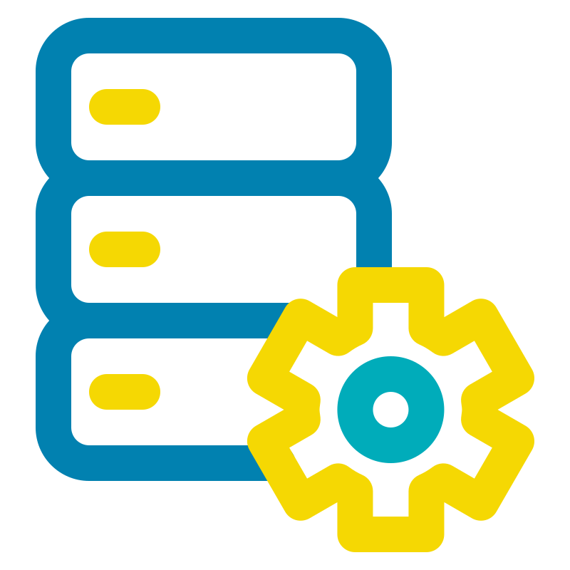

# :wave: Hello! I'm Oscar, nice to meet you!

I'm an Industrial engineer with a strong passion for Data & AI, offering hands-on experience with SQL, Python, AWS for ETL processes, and Power BI for business intelligence and analytics. Eager to apply analytical and technical skills to solve complex business problems and drive data-driven decision-making. Currently building a portfolio of data and AI projects, and highly motivated to contribute to innovative teams at the intersection of industry and technology.

## Last publications 📰

## Take a look to my latest projects 🏗️

## Languages and tools 🖥️

<table>
  <tr>
    <td align="center" width="96">
      
       Databricks
    </td>
    <td align="center" width="96">
      
       Python
    </td>
    <td align="center" width="96">
      
       SQL
    </td>
    <td align="center" width="96">
      
       Power BI
    </td>
    <td align="center" width="96">
      
       AWS
    </td>
    </td>
    <td align="center" width="96">
      
       Azure
    </td>
    <td align="center" width="96"> 
      
       Docker
    </td>
    <td align="center"  width="96">
      
       Git
    </td>
    <td align="center" width="96">
      
       Machine Learning
    </td>
    <td align="center" width="96">
      
       Spark
    </td>
  </td>
    <td align="center" width="96">
      
       ETL
    </td>
  </tr>
</table>

## My socials 💬

- Connect with me on **[LinkedIn]**

<!--
**oscarl11/oscarl11** is a ✨ _special_ ✨ repository because its `README.md` (this file) appears on your GitHub profile.

  
  
  
  
  
  
  
  
  
  
  
  
  

  
  
  

<!-- For more icons please follow  https://github.com/MikeCodesDotNET/ColoredBadges 
  
  
  
  
  
  
  
  
  

-->
<!--Here are some ideas to get you started:

- 🔭 I’m currently working on ...
- 🌱 I’m currently learning ...
- 👯 I’m looking to collaborate on ...
- 🤔 I’m looking for help with ...
- 💬 Ask me about ...
- 📫 How to reach me: ...
- 😄 Pronouns: ...
- ⚡ Fun fact: ...
-->
[Linkedin]:https://www.linkedin.com/in/oscar-luna-silvera/ "Oscar Luna"
